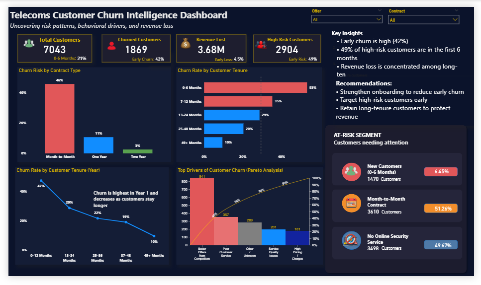

# 📊 Telecom Customer Churn Intelligence Dashboard

## 📌 Overview
This project presents a **customer churn analysis dashboard** built in Microsoft Power BI, focused on identifying **where churn occurs, why it happens, and its business impact**.

Unlike traditional time-based analysis, this dashboard uses a **customer lifecycle (tenure-based) approach** to uncover actionable insights.

---

## 🖼️ Dashboard Preview

---

## 🎯 Objectives
- Analyze customer churn across lifecycle stages  
- Identify key drivers of churn  
- Quantify revenue impact  
- Highlight high-risk customer segments  
- Provide actionable recommendations  

---

## 📂 Dataset
The dataset includes:
- Customer demographics  
- Contract type  
- Services (e.g., online security)  
- Monthly and total charges  
- Tenure (lifecycle stage)  
- Churn status  

---

## 🧠 Key Insights
- Early churn is high (**42% occurs within the first 6 months**)  
- **49% of high-risk customers** are in the early stage  
- Revenue loss is **concentrated among long-tenure customers**  

---

## 💡 Recommendations
- Strengthen onboarding to reduce early churn  
- Target high-risk customers early  
- Retain long-tenure customers to protect revenue  

---

## 📊 Dashboard Features

### 🔹 KPI Overview
- Total Customers  
- Churned Customers  
- Revenue Lost  
- High-Risk Customers  
- Lifecycle-based context (0–6 months)

### 🔹 Churn by Contract Type
- Identifies month-to-month contracts as highest churn segment  

### 🔹 Churn by Tenure
- Shows churn declines as tenure increases  
- Highlights early-stage risk  

### 🔹 Key Drivers of Churn
- Contract type  
- Service adoption  
- Customer tenure  

### 🔹 At-Risk Segments
- New customers (0–6 months)  
- Month-to-month contracts  
- No online security  

---

## 🛠️ Tools & Technologies
- Microsoft Power BI  
- DAX (Data Analysis Expressions)  
- Data Modeling  

---

## 🧩 Data Model
- Fact Table: Customer data  
- Dimension Tables:
  - Account (tenure, contract)  
  - Services  

A **risk scoring model** identifies high-risk customers based on:
- Tenure ≤ 6 months  
- Month-to-month contract  
- No online security  

---

## 📈 Key Metrics
- Churn Rate (%)  
- Early Churn Contribution (%)  
- Revenue Lost  
- Early Revenue Loss (%)  
- High-Risk Customers  
- Early Risk Contribution (%)  

---

## 🚀 Project Value
This dashboard helps stakeholders:
- Identify where churn is concentrated  
- Distinguish between volume vs revenue impact  
- Take targeted retention actions  

---

## 📎 Files
- `telecom-customer-churn-dashboard.pbix`  
- `telecom-customer-churn-dashboard.png`  

---

## ⭐ Support
If you found this useful, consider giving the project a star ⭐
